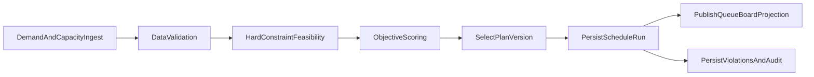
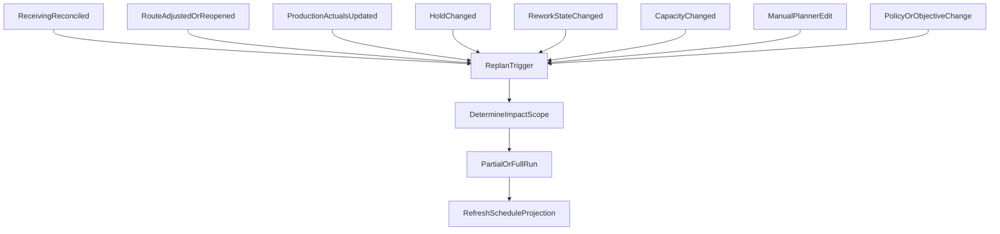
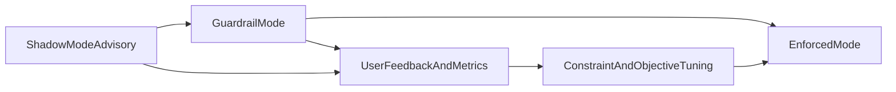

# LPC MES v2 - Finite-Capacity Scheduling Specification

## 1) Document Control

- Version: v0.1 (Draft target-state)
- Status: Draft for architecture and implementation planning
- Owner: MES product and engineering
- Purpose: Define the target-state finite-capacity and constraint-aware scheduling model for production and logistics planning in LPC MES v2.

## 2) Scope

This specification defines:
- finite-capacity planning concepts and data contracts
- hard/soft constraint model and optimization objectives
- scheduling run behavior and replanning triggers
- integration with lifecycle workflow, route execution, and board APIs
- role/security boundaries for planner and override actions
- rollout modes from advisory to enforced planning policies

Out of scope for this document:
- exact third-party solver selection
- final UI styling details
- ERP invoice algorithm changes

## 3) References and Terminology Alignment

This document aligns with:
- `designInput/SPEC_ORDER_TO_CASH_STATUS_FLOW.md`
- `designInput/SPEC_WORKCENTER_OPERATOR_WORKFLOW.md`
- `designInput/SPEC_DATA_REFERENCE.md`
- `designInput/SECURITY_ROLES.md`
- `designInput/GENERAL_DESIGN_INPUT.md`
- `designInput/REFERENCE_ARCHITECTURE.md`

Canonical lifecycle and overlay enums remain unchanged:
- `OrderLifecycleStatus` (for example `ReadyForProduction`, `InProduction`, `ProductionComplete`, `InvoiceReady`, `Invoiced`)
- `HoldOverlay` (for example `OnHoldQuality`, `OnHoldCustomer`, `ExceptionDocumentation`, `ReworkOpen`)

`OrderLifecycleStatus` remains the business workflow projection. Scheduling introduces a planning projection and does not replace lifecycle ownership.

Promise-date source-of-truth alignment:
- `CurrentCommittedDateUtc` is owned by `SPEC_ORDER_TO_CASH_STATUS_FLOW.md` commitment governance.
- Scheduler reads the active `CurrentCommittedDateUtc` projection from canonical order data; it does not author or revise customer commitments.

## 4) Design Principles

1. Explainability first: every plan decision must be traceable to constraints and objective weights.
2. Feasibility before optimality: hard constraints are always satisfied before objective scoring.
3. Event-driven updates: schedule state is refreshed from receiving, route execution, hold, and manual planning events.
4. Service-layer domain logic: scheduling decisions are implemented in backend services, not controllers.
5. Azure-ready operation: configuration-driven behavior, no local-only assumptions, and support for asynchronous scale-out patterns.

## 5) Planning Horizon and Time Buckets

### 5.1 Planning Window

- Rolling horizon: configurable, default 14 days.
- Near-term freeze window: configurable, default 4 hours.
- Bucketing granularity: configurable by site, default 15 minutes.
- Site-local calendars with UTC storage.

### 5.2 Run Cadence

- Event-triggered micro replan for impacted entities.
- Scheduled full replan (for example nightly and shift-start).
- Manual planner-triggered run with scenario label.

## 6) Scheduling Data Model

The model extends canonical entities from `SPEC_DATA_REFERENCE` without redefining existing route execution records.

### 6.1 Core Planning Entities

#### `WorkCenterCapacityCalendar`
- `Id`
- `SiteId`
- `WorkCenterId`
- `CapacityBucketStartUtc`
- `CapacityBucketEndUtc`
- `AvailableMinutes`
- `ReservedMinutes`
- `CapacityReasonCode` (shift, overtime, maintenance, outage)
- `Version`

#### `ScheduleDemandOperation`
- `Id`
- `SalesOrderId`
- `SalesOrderDetailId`
- `OrderLineRouteInstanceId`
- `OrderLineRouteStepInstanceId` (nullable before instance exists)
- `StepSequence`
- `EligibleWorkCenterIds` (resolved set)
- `EstimatedRunMinutes`
- `EstimatedSetupMinutes`
- `EarliestStartUtc`
- `LatestFinishUtc` (derived from `CurrentCommittedDateUtc` and policy; fallback to `PromisedDateUtc` only for backward compatibility during migration)
- `PriorityScoreInput`
- `DemandClass` (`Normal`, `Rework`)
- `State` (`Unscheduled`, `Scheduled`, `InProgress`, `Completed`, `Deferred`, `Blocked`)

#### `ScheduleAllocation`
- `Id`
- `ScheduleDemandOperationId`
- `AssignedWorkCenterId`
- `AssignedOperatorEmpNo` (nullable)
- `PlannedStartUtc`
- `PlannedEndUtc`
- `PlannedSetupStartUtc` (nullable)
- `PlanVersion`
- `AllocationState` (`Tentative`, `Committed`, `Locked`, `Released`)
- `ReservationType` (`Primary`, `ReworkReserved`)

#### `ScheduleRun`
- `Id`
- `SiteId`
- `RunType` (`Event`, `Manual`, `Scheduled`)
- `Mode` (`Advisory`, `Guardrail`, `Enforced`)
- `HorizonStartUtc`
- `HorizonEndUtc`
- `StartedUtc`
- `CompletedUtc`
- `AlgorithmVersion`
- `ObjectiveProfileId`
- `TriggeredBy`
- `CorrelationId`

#### `ScheduleConstraintViolation`
- `Id`
- `ScheduleRunId`
- `ScheduleDemandOperationId`
- `ViolationType` (enum in Section 7)
- `Severity` (`Error`, `Warning`, `Info`)
- `Message`
- `Blocking`
- `CreatedUtc`

#### `ScheduleChangeAudit`
- `Id`
- `ScheduleRunId` (nullable for manual edits)
- `EntityType`
- `EntityId`
- `ActionType` (`Assign`, `Reassign`, `Split`, `Defer`, `Lock`, `Override`)
- `BeforeJson`
- `AfterJson`
- `ActorEmpNo`
- `RoleContext`
- `ReasonCode`
- `ReasonNote`
- `OccurredUtc`

### 6.2 Optional Supporting Entities

- `SetupFamily` and `WorkCenterSetupMatrix` for setup-change penalties.
- `OperatorSkillMatrix` is out of scope for this specification baseline.
- `DockSlotCapacity` (transport capacity constraints) is out of scope for this specification baseline.

## 7) Constraint Model

### 7.1 Hard Constraints (must pass)

1. Finite capacity: allocated minutes in a bucket cannot exceed available minutes.
2. Route precedence: `StepSequence(n)` cannot start before required predecessor completion.
3. Workcenter eligibility: step must run on allowed work center(s).
4. Freeze window integrity: locked near-term allocations cannot be moved without explicit override.
5. Hold enforcement: blocked overlays prevent forward scheduling where policy requires.
6. Site boundary: scheduling and overrides must stay within authorized site scope.
7. Data completeness guards: missing required prerequisites (for example route not validated when required) yields blocking violation.
8. Rework integrity: operations with blocking `ReworkOpen` cannot be treated as complete for downstream completion guards.

### 7.2 Soft Constraints (objective penalties)

1. Tardiness vs `PromisedDateUtc`.
2. Setup/changeover cost between neighboring allocations.
3. Excessive WIP and queue aging at constrained work centers.
4. Priority adherence (`Priority` and policy multipliers).
5. Preference for stable schedules (minimize churn from previous plan).
6. Rework response latency after approval (penalize delayed assignment of approved rework demand).

### 7.4 Default Objective Profile (Initial Site Baseline)

Until a site defines a custom profile, use the following default objective weighting:

- due-date lateness minimization: `45%`
- priority/expedite adherence: `25%`
- schedule stability (minimize churn): `15%`
- setup/changeover minimization: `10%`
- WIP/queue-age balancing: `5%`

These defaults are intended to protect customer commitments first while limiting operational thrash and still capturing basic setup efficiency.

Default policy guardrails for this profile:
- freeze window: `4` hours
- auto-reschedule scope in normal runs: next `24` hours only
- supervisor confirmation required when a planner action increases projected lateness over configured threshold (site policy)
- weekly weight review during advisory rollout, then lock profile for guardrail mode unless approved change request
- default dispatch behavior for approved rework demand: elevate dispatch priority above normal unscheduled work at same work center/date unless an explicit customer expedite policy conflicts

### 7.3 Violation Types

- `InsufficientCapacity`
- `PrecedenceConflict`
- `IneligibleWorkCenter`
- `FrozenWindowConflict`
- `BlockedByHoldOverlay`
- `MissingRouteApproval`
- `UnauthorizedCrossSiteAttempt`
- `DataContractIncomplete`

## 8) Planning Engine Behavior

### 8.1 Pipeline

1. Ingest demand and capacity.
2. Validate data contracts and produce blocking errors early.
3. Build feasible schedule satisfying all hard constraints.
4. Score candidate plans with objective profile.
5. Persist selected `ScheduleRun`, allocations, and violations.
6. Publish projections to queue/board APIs.

### 8.2 Replan Triggers

- receiving reconciliation completed
- route review adjusted or reopened
- production step started/completed
- hold applied/cleared
- rework requested/approved/closed
- workcenter capacity changed (shift, downtime)
- manual assignment/reassignment/defer/split
- objective profile or policy change

### 8.3 Solver Modes

- Advisory: no workflow blocking, conflicts only.
- Guardrail: selected transitions require no blocking violations.
- Enforced: critical scheduling actions and transitions are blocked on violations unless approved override.

### 8.4 Explainability Contract

Each scheduled operation must expose:
- why this slot was selected (constraint and score factors)
- why alternatives were rejected
- which changes occurred since previous plan version

## 9) Lifecycle and Workflow Integration

### 9.1 Inbound to Production

- On `ReceivedPendingReconciliation -> ReadyForProduction`, demand generation for route steps becomes active.
- Scheduler creates/updates `ScheduleDemandOperation` records for required steps.
- Lifecycle state is not auto-advanced by scheduler output alone.

### 9.2 Production Execution Feedback

- On route step `InProgress` and `Completed` events, consumed/remaining capacity is reconciled.
- Actual durations update forecasting and subsequent scheduling quality.
- Final required step completion for all required lines supports lifecycle transition checks to `ProductionComplete`.
- When rework is opened on a previously completed required step, scheduler must:
  - re-activate corresponding demand as `DemandClass = Rework`,
  - release or adjust stale downstream allocations that depended on the previously completed state,
  - refresh completion projection so `ProductionComplete`/invoice guard checks remain consistent.

### 9.3 Outbound Integration

- When site policy requires outbound appointment planning, planner can project dock/truck slots.
- `ProductionComplete -> OutboundLogisticsPlanned` guard can consume scheduling feasibility and hold status.

### 9.4 Transition Guard Policies

Default target-state policies:
- `ReadyForProduction -> InProduction`: requires at least one planned or actively started required step.
- `InProduction -> ProductionComplete`: requires all required route steps complete and no blocking scheduling violations.
- `ProductionComplete -> OutboundLogisticsPlanned` or `DispatchedOrPickupReleased`: requires policy-specific outbound capacity checks where enabled.
- `DispatchedOrPickupReleased -> InvoiceReady`: unchanged from lifecycle spec except explicit blocking overlays/exceptions remain authoritative.
- Any transition to `InvoiceReady` or `Invoiced` remains blocked while blocking `ReworkOpen` exists (lifecycle spec remains authoritative).

### 9.5 Rework Capacity Reservation Policy (Minimum v0.2 Baseline)

- Approved rework creates/updates `ScheduleDemandOperation` records with `DemandClass = Rework`.
- Planner/engine should reserve near-term capacity for approved rework using `ReservationType = ReworkReserved`.
- Rework reservation is default policy-limited to impacted work centers and nearest feasible buckets, to avoid full-plan churn.
- If reserved rework capacity is not consumed within policy timeout, reservation may be released automatically with audit trail.

## 10) API Contracts (Target-State)

These endpoint contracts describe the target behavior and can be introduced incrementally.

### 10.1 Planner Runs

- `POST /api/scheduling/runs`
  - Request: `siteId`, horizon, mode, objective profile, optional impact scope.
  - Response: `scheduleRunId`, run summary, blocking violation count.

- `GET /api/scheduling/runs/{runId}`
  - Response: run metadata, objective metrics, warning/error counts.

### 10.2 Queue and Board Projection

- `GET /api/scheduling/production-board`
  - Filters: `siteId`, workcenter, date window, risk state, status.
  - Returns: planned windows, assignment, slack, violation badges, and rework markers (`DemandClass`, `ReservationType` where applicable).

### 10.3 Planner Actions

- `POST /api/scheduling/allocations/assign`
- `POST /api/scheduling/allocations/reassign`
- `POST /api/scheduling/allocations/split`
- `POST /api/scheduling/allocations/defer`
- `POST /api/scheduling/allocations/lock`
- `POST /api/scheduling/allocations/override`

Each mutating action requires:
- optimistic concurrency token/version
- reason code for privileged actions
- role/site authorization checks
- audit entry in `ScheduleChangeAudit`

### 10.4 Conflict and Explainability

- `GET /api/scheduling/conflicts`
- `GET /api/scheduling/operations/{operationId}/explanation`

## 11) UI Behavior (Target-State)

### 11.1 Production Planning Views

- workcenter lane board with finite capacity visualization per bucket
- operation cards with planned start/end, setup, priority, and risk indicators
- conflict badges with reason codes and quick actions
- clear marker for frozen window and lock state

### 11.2 Operator and Supervisor Experience

- operators see committed assignments and real-time route requirements
- supervisors can approve overrides and reopen locked allocations with reason
- all privileged actions show policy and audit prompts

### 11.3 Out of Scope for This Baseline

- transportation capacity optimization (dock/truck slot constraints)
- operator skill-matrix-constrained assignment optimization

## 12) Security and Authorization Mapping

Role mapping aligns with `SECURITY_ROLES` and site-scope enforcement:

- `Production`: execute assigned work, view personal/workcenter queue.
- `Supervisor` and `PlantManager`: override, reopen, lock/unlock, approve conflict exceptions.
- `Transportation`: manage outbound slot plans where policy grants.
- `Admin`: emergency controls, policy management, cross-site exception where explicitly granted.
- `ReadOnly`: read projections only, no scheduling mutations.

Security requirements:
- all mutating scheduling APIs enforce server-side authorization and `SiteId` scope
- cross-site actions blocked unless explicit permission exists
- privileged overrides require reason code/note and actor role context capture

## 13) Non-Functional Requirements

### 13.1 Performance

- interactive queue/board reads: target p95 <= 1.5s for normal operational filters
- planner run SLA:
  - micro replan (impacted scope): target <= 10s
  - full-site daily plan: target <= 5m (configurable by data size)

### 13.2 Concurrency and Data Integrity

- use optimistic concurrency on schedule entities (`Version`/rowversion)
- reject stale writes with actionable conflict payload
- preserve plan history by version; do not mutate historical run records

### 13.3 Reliability and Resilience

- planner failures must not corrupt lifecycle status ownership
- advisory mode fallback if optimizer stage fails
- background processing retries for transient infrastructure failures

### 13.4 Azure Readiness

- configuration-driven horizons, policies, and solver mode
- no hardcoded paths, ports, or environment-specific assumptions
- support scale-out safe background scheduling runs

### 13.5 Long-Run Optimization Execution Architecture (Required)

Long-running optimization must execute on a dedicated worker architecture.

- API role:
  - validate/accept run request
  - persist run request metadata
  - enqueue optimization work item
  - return async run identifier
- Worker role:
  - consume queued run requests
  - execute optimization with retry/backoff policy
  - persist allocations/violations and run outcome
  - emit completion/failure events and telemetry

In-process API execution is allowed only for lightweight feasibility checks and local development diagnostics, not for production scale optimization workloads.

## 14) Observability and Auditability

Required telemetry:
- schedule run duration, affected operations, objective score, violation counts
- API latency and failure rates by endpoint
- override counts by role/site/reason

Required audit trail:
- who changed what, when, and why
- before/after allocation snapshots
- associated `CorrelationId` for integration-impacted actions

## 15) Rollout and Migration Strategy

### 15.1 Phase 1: Shadow (Advisory)

- scheduler computes plan and conflicts
- UI shows `Unscheduled`, `Scheduled`, `AtRisk`, `Blocked`
- no lifecycle transition is blocked by scheduling

### 15.2 Phase 2: Guardrail

- selected transitions enforce no blocking scheduling violations
- overrides available for privileged roles with full audit

### 15.3 Phase 3: Enforced + Optimized

- constrained actions are blocked by policy when plan infeasible
- optimization stage enabled for selected sites/objective profiles
- periodic and event-driven runs both active

### 15.4 Migration Notes

- additive schema changes first, then projection APIs
- feature flags per site and per board
- backout path: disable scheduling guardrail/enforced flags and continue lifecycle operations

### 15.5 Low-Burden Adoption (Required Product Behavior)

To prevent non-adoption from high setup overhead, the scheduling feature must be usable with minimal initial configuration.

Default-first requirements:
- one-click site bootstrap must create default workcenter calendars and capacity buckets
- default calendar template: weekday operating window + breaks + weekend off (site-configurable)
- default capacity formula for each workcenter:
  - `AvailableMinutes = BucketMinutes x ActiveOperatorCount x EfficiencyFactor`
  - default `EfficiencyFactor = 0.80` until history-based tuning is available

Auto-bootstrap requirements:
- initial run/setup estimates must be seeded from recent production history when available
- if history is missing, use route-template standard minutes with conservative padding
- solver should continuously learn from actual durations using rolling averages by workcenter and step type

Minimal manual data requirements for go-live:
1. active workcenter list per site
2. basic shift calendar per workcenter (or site default)
3. known downtime exceptions (maintenance/outage windows)
4. optional priority policy profile

All other fields should be optional in phase 1 and progressively enabled in later maturity phases (for example setup optimization).

Operational rollout policy:
- phase 1 must run in `Advisory` mode by default
- no hard blocks until site has completed an observation period and conflict quality review
- planner UI should prioritize exception management (downtime, overtime, lock/unlock), not full-model authoring

Adoption success target:
- initial site setup time should be less than 60 minutes
- scheduling should produce useful conflict and sequencing recommendations on day 1 with default data
  - "useful" means planners can identify overload windows, late-risk orders, and feasible reassignments without additional model tuning

## 16) Risks and Mitigations

1. Over-constrained rules cause operational deadlock.
   - Mitigation: advisory burn-in, staged guardrails, supervisor override.
2. Plan churn confuses operators.
   - Mitigation: freeze window and schedule stability penalties.
3. Performance regressions in list endpoints.
   - Mitigation: indexed projections, pagination, and scoped queries.
4. Security drift between policy and implementation.
   - Mitigation: server-side policy checks and role-site audit assertions.

## 17) Acceptance Criteria

1. Feasibility engine always rejects schedules violating hard constraints.
2. Production board exposes planned windows, assignments, and conflict reason codes.
3. Replan triggers update impacted operations without full rebuild when scope allows.
4. Transition guard behavior is configurable per mode (`Advisory`, `Guardrail`, `Enforced`).
5. All schedule mutations are versioned, auditable, and site-authorized.
6. End-to-end flow supports receive -> plan -> execute -> release with consistent status projection and no policy bypass.

## 18) Test Strategy (Implementation Guidance)

### 18.1 Backend

- unit tests for each hard constraint type
- objective scoring tests with deterministic fixtures
- authorization/site-scope tests for every mutating endpoint
- concurrency conflict tests for schedule edits

### 18.2 Frontend

- board rendering tests for assignment and violation states
- interaction tests for assign/reassign/defer workflows
- role-based action availability tests

### 18.3 Smoke and Operational Verification

- representative site data simulation including constrained workcenter
- verify at least one valid and one infeasible scenario
- validate audit records and observability metrics on planner and override actions

## 19) Open Decisions

1. Initial objective weight profile by site (lateness vs setup vs stability).

## 20) Implementation Checklist (Ticket-Ready)

Use this checklist to convert the specification into engineering work items. Mark each item complete only when its done criteria are met.

### 20.1 Phase A - Advisory Foundation

- [ ] **A1. Schema: scheduling core tables**
  - Add entities/tables for `WorkCenterCapacityCalendar`, `ScheduleDemandOperation`, `ScheduleAllocation`, `ScheduleRun`, `ScheduleConstraintViolation`, `ScheduleChangeAudit`.
  - Done when:
    - EF Core migration exists and applies cleanly.
    - read/write integration tests cover basic CRUD and indexing paths.

- [ ] **A2. Capacity bootstrap defaults**
  - Implement one-click site bootstrap for default calendars, buckets, and baseline capacity formula.
  - Done when:
    - site setup can produce usable capacity without manual per-bucket entry.
    - setup time target (< 60 minutes) is documented and validated in UAT script.

- [ ] **A3. Demand generation from workflow events**
  - Create/refresh demand on receiving reconciliation and relevant route changes.
  - Done when:
    - receiving -> demand creation is verifiable end-to-end.
    - idempotency is enforced for repeated triggers.

- [ ] **A4. Feasibility engine (hard constraints only)**
  - Implement deterministic hard-constraint pass and violation generation.
  - Done when:
    - infeasible cases produce `Blocking=true` violations with reason codes.
    - feasible cases emit allocations with no hard-constraint violations.

- [ ] **A5. Advisory projections API**
  - Expose production-board projection with planned windows and conflict badges.
  - Done when:
    - endpoint supports filtering/paging and returns required schedule fields.
    - p95 read latency target is measured under representative load.

- [ ] **A6. Frontend advisory board**
  - Add schedule columns/badges in production planning UI (`Unscheduled`, `Scheduled`, `AtRisk`, `Blocked`).
  - Done when:
    - users can identify overload windows and conflict reasons without additional model setup.
    - RTL/Vitest coverage includes rendering and basic filtering.

### 20.2 Phase B - Guardrail Controls

- [ ] **B1. Transition guard hooks**
  - Add workflow guard checks for selected transitions using blocking violations.
  - Done when:
    - mode-gated checks enforce policy in `Guardrail` mode only.
    - existing lifecycle rules remain intact when mode is `Advisory`.

- [ ] **B2. Planner action endpoints**
  - Implement `assign`, `reassign`, `split`, `defer`, `lock`, `override`.
  - Done when:
    - optimistic concurrency is enforced.
    - stale-write responses are user-actionable.

- [ ] **B3. Security + site scope enforcement**
  - Enforce role permissions and site boundaries on all mutating scheduling APIs.
  - Done when:
    - unauthorized attempts return structured `403`.
    - tests cover cross-site denial and override authorization.

- [ ] **B4. Audit and explainability**
  - Persist before/after snapshots and operation explanation payloads.
  - Done when:
    - each mutation creates `ScheduleChangeAudit` record with actor/role/reason.
    - operation explanation endpoint returns decision rationale.

- [ ] **B5. Frontend planner interactions**
  - Add planner actions and supervisor override UX with reason capture.
  - Done when:
    - UI enforces reason entry for privileged actions.
    - optimistic updates rollback correctly on concurrency errors.

### 20.3 Phase C - Enforced + Optimization

- [ ] **C1. Soft-constraint scoring engine**
  - Add objective profile scoring (lateness, setup, WIP, stability).
  - Done when:
    - objective profile is config-driven and versioned.
    - benchmark scenarios show deterministic score changes.

- [ ] **C2. Scheduled/background run orchestration**
  - Add full-run cadence and resilient retry behavior for dedicated-worker planner jobs.
  - Done when:
    - API enqueues run requests and returns async run IDs.
    - dedicated worker consumes queue messages and writes run outcomes.
    - run status/telemetry is visible.
    - retry/backoff handles transient failures.

- [ ] **C3. Enforced mode activation controls**
  - Add per-site feature flags for enforced scheduling gates.
  - Done when:
    - sites can opt into enforced mode independently.
    - documented backout path restores non-blocking operations quickly.

### 20.4 Cross-Layer Contract Checklist

- [ ] **D1. Backend model -> DTO alignment**
  - Done when schedule fields in APIs match canonical names and enum values.
- [ ] **D2. Frontend type sync**
  - Done when frontend types map 1:1 to API contracts for scheduling fields.
- [ ] **D3. Error contract consistency**
  - Done when violations/authorization/concurrency errors are structured and documented.
- [ ] **D4. Migration safety**
  - Done when migrations are additive-first and include rollback notes.

### 20.5 Test and Verification Checklist

- [ ] **E1. Constraint unit tests**
  - hard-constraint pass/fail coverage by violation type.
- [ ] **E2. Workflow integration tests**
  - receive -> plan -> execute -> release path with schedule projection checks.
- [ ] **E3. Security tests**
  - role and site-scope coverage for every mutating endpoint.
- [ ] **E4. Performance tests**
  - board/read p95 and planner run SLA validation against target thresholds.
- [ ] **E5. Smoke test script**
  - one feasible and one infeasible scenario with expected UI/API outcomes.

### 20.6 Definition of Done for First Production Rollout

The first site is ready for rollout when all conditions are true:
- Phase A checklist items are complete.
- Guardrail checks are validated in pre-production with no critical regressions.
- Advisory period metrics show conflict quality is actionable for planners.
- Backout switch is tested and documented.
- Training notes exist for planner and supervisor workflows.

