# LPC MES v2 Specification: Configurable Work-Center Operator Workflow

## 1) Document Control

- **Version:** v0.1 (Draft)
- **Status:** Draft for business review
- **Scope:** Define configurable, order-line-level routing and operator execution workflow before code implementation.
- **Out of scope (v0.1):**
  - Automated optimization/scheduling algorithms
  - IoT machine telemetry integration
  - Cross-order batching/parallel execution logic

## 2) Business Goal

LPC operates as a job shop. Each order line may pass through a different sequence of work centers based on business rules, with route defaults driven by item type and optional refinements by item/customer/site/order attributes.

The system must:

- Let operators start and stop work-center time via job scan-in and scan-out.
- Capture required production data at each work center (details, parts usage, scrap).
- Mark production complete when the final required work center is complete.
- Support a configurable supervisor review gate before shipment/pickup readiness.

## 3) Key Decisions (Confirmed)

- **Routing granularity:** Order-line-level route execution with order-level rollup.
- **Route defaulting:** Primarily by item type, with additional conditions (item/customer/site/order attributes).
- **Supervisor gate:** Configurable by customer/item/site rules (not always required).
- **Delivery artifact preference:** Single master specification with high-fidelity operator UI design.

## 3.1) Current-State Constraint

Current screens support office-oriented workflow and partial production data entry, but there is no complete scan-first shop-floor operator interface for work-center execution. This specification defines that missing operator workflow as a primary deliverable.

## 4) Functional Overview

### 4.1 Route Resolution

When an order enters production eligibility, the system resolves a route template for each sales order line and creates an order-line route instance per line.

Template-assignment precedence (template-first model):

1. Exact assignment match: customer + item + site
2. customer + itemType + site
3. item + site
4. itemType + site
5. customer + site
6. site default
7. global default

If multiple assignments match at the same tier, highest priority wins, then latest effective revision wins.

Each assignment is versioned and date-bound:
- `RevisionNo` identifies assignment revision.
- `EffectiveFromUtc` and `EffectiveToUtc` define active window.
- Only active assignments in date window are considered during resolution.

After auto-resolution, a **Plant Manager or Supervisor review checkpoint** is supported before the first production step starts for a line route (or route family group):

- Reviewer can **validate as-is** or **adjust step sequence** (add/remove/reorder optional steps, change work center when permitted by policy).
- Required compliance/safety steps cannot be removed.
- All adjustments must capture reviewer identity, timestamp, and reason code/note.
- Once the first step is scanned in, route edits are locked unless a formal reopen action is used.

### 4.2 Work-Center Step Execution

Each line route contains ordered steps. Each step can require different data capture.

Operator actions:

1. Scan job number to start step (`Scan In`)
2. Perform work
3. Enter required step data (as configured)
4. Scan job number again to stop step (`Scan Out`)
5. Complete step

Time capture:

- `StartTimeUtc` from scan-in
- `EndTimeUtc` from scan-out
- `DurationMinutes` system calculated

### 4.2.1 Configurable Time Capture Modes

Time capture is configurable by work center and can be overridden at route-step level:

1. **Automated (Scan In/Out)**
  Operator scans to start and scans to stop; system computes duration.
2. **Manual Entry**
  Operator enters elapsed time directly (`HH:MM` or minutes).
3. **Hybrid (Automated + Editable with Reason)**
  System captures scan-based time but allows authorized correction with required reason.
4. **Machine/Integration Feed (Future Phase)**
  Duration is posted from machine/PLC/integration event stream.
5. **Standard Time (Future Phase)**
  Duration defaults from configured standard run time; optional override policy.

For v0.1 scope, modes 1-3 are in scope; 4-5 are future-phase options.

### 4.3 Configurable Step Requirements

Each route step can independently require:

- Data capture mode (`ElectronicRequired`, `ElectronicOptional`, `PaperOnly`)
- Time capture mode (`Automated`, `Manual`, `Hybrid`)
- Material/parts usage entry
- Component lot/batch capture on usage lines (for lot-tracked components)
- Component serial capture on usage lines (for serial-tracked components)
- Scrap quantity and reason entry
- Attachment/photo evidence
- Serial capture (`SerialNo`, `Manufacturer`, `ManufactureDate`, `TestDate`, `LidColor`, `LidSize`, `Good/Bad`)
- Scrap reason when serial is marked `Bad`/scrapped
- **Requires Checklist Completion**
- **Checklist Failure Policy** (`BlockCompletion`, `AllowWithSupervisorOverride`)
- Trailer capture (loading step)
- Optional serial load verification (loading step)
- Generate `Packing Slip` on loading completion
- Generate `Bill of Lading` on loading completion
- Supervisor approval at completion
- **Requires Reason On Exception**
- **Allows Partial Completion**

When `DataCaptureMode = PaperOnly`, the system still records a minimal execution trace (who, when, step completion) but does not enforce full electronic data entry for that step.

### 4.4 Completion Behavior

- When the final required step is completed for a line route:
  - If supervisor gate required: order status becomes `Pending Supervisor Review`.
  - If no gate required: order advances to shipping/pickup-ready status according to order transport mode.
- Order-level completion is a rollup outcome: all required line routes must be completed (and approved when required).

### 4.5 Rework Loop (Minimum v0.2 Baseline)

Rework is modeled as a controlled overlay on route-step execution, not a separate top-level order lifecycle.

Minimum triggers:

- Failed in-process or final quality/checklist result.
- Operator-reported defect discovered during or after step completion.
- Supervisor/quality hold requiring correction before release.

Minimum ownership:

- Operator can raise rework request with reason/evidence.
- Supervisor or Quality approves disposition and assigns owner.
- Production executes rework.
- Supervisor or Quality verifies closure.

Disposition outcomes:

- `Rework` (perform corrective work and re-verify)
- `Scrap` (line quantity impact handled through scrap controls)
- `UseAsIs` (allowed only with supervisor/quality authorization and reason)

Route completion impact:

- Opening rework on a completed required step reverts that step to not-complete for route rollup until rework is closed.
- `LineRouteCompleted` cannot be true while blocking rework remains open.

## 5) Workflow State Model

```mermaid
flowchart LR
  lineEligible[OrderLineEligibleForProduction] --> routeResolved[LineRouteResolved]
  routeResolved --> routeReview{RouteReviewRequired}
  routeReview -->|Yes| pendingRouteReview[PendingRouteReview]
  pendingRouteReview --> routeApproved[LineRouteApprovedOrAdjusted]
  routeReview -->|No| routeApproved
  routeApproved --> stepActive[ActiveWorkCenterStep]
  stepActive --> stepDataCaptured[StepDataCaptured]
  stepDataCaptured --> stepCompleted[StepCompleted]
  stepCompleted --> moreSteps{MoreRequiredSteps}
  moreSteps -->|Yes| stepActive
  moreSteps -->|No| lineDone[LineRouteCompleted]
  lineDone --> supervisorRequired{SupervisorGateRequired}
  supervisorRequired -->|Yes| pendingReview[PendingSupervisorReview]
  supervisorRequired -->|No| lineApproved[LineApproved]
  pendingReview --> approved[SupervisorApproved]
  approved --> lineApproved
  lineApproved --> allLinesDone{AllRequiredLineRoutesDone}
  allLinesDone -->|Yes| readyForShipPickup[ReadyForShipOrPickup]
  allLinesDone -->|No| waitOthers[WaitForOtherLines]
```

## 6) Roles and Permissions

- **Operator**
  - View assigned/current work-center queue and order details
  - Scan in/out and complete steps
  - Enter usage and scrap where required
  - Create rework request with reason/evidence
- **Supervisor**
  - Validate or adjust resolved route before production start (per policy)
  - View orders pending supervisor review
  - Approve/reject/reopen as configured
  - Approve rework request, set disposition, assign owner
  - Close rework after verification (or reject closure attempt)
- **Plant Manager**
  - Same route validation/adjustment rights as Supervisor (site-scoped)
  - Can enforce route corrections before operator execution
- **Quality**
  - Approve/verify quality-driven rework events where quality policy requires
- **Setup/Admin**
  - Configure work centers, route templates, rules, and step requirements
  - Configure which routes/work centers allow pre-start adjustments

## 7) Configuration Specification

### 7.1 Work Center

- `WorkCenterCode` (unique)
- `WorkCenterName`
- `SiteId`
- `IsActive`
- `Capabilities` (usage capture, scrap capture, attachments, etc.)
- `DefaultTimeCaptureMode` (`Automated`, `Manual`, `Hybrid`)

### 7.2 Route Template

- `RouteTemplateCode` (unique)
- `RouteTemplateName`
- `IsActive`
- `VersionNo` (template revision)
- Ordered steps with:
  - `StepSequence`
  - `WorkCenterCode`
  - `IsRequired`
  - `TimeCaptureMode` (`Automated`, `Manual`, `Hybrid`, default from work center)
  - `RequiresUsageEntry`
  - `RequiresScrapEntry`
  - `RequiresSupervisorApproval`

### 7.3 Route Template Assignment

- `Priority` (integer, lower number = higher precedence)
- `RevisionNo` (assignment revision number)
- `IsActive` (assignment activation flag)
- Effective date window:
  - `EffectiveFromUtc`
  - `EffectiveToUtc`
- Assignment tags (nullable for broader matching):
  - `CustomerId`
  - `ItemType`
  - `ItemId`
  - `SiteId`
  - Optional order filters (`OrderPriorityMin`, `OrderPriorityMax`, `PickUpViaId`, `ShipToViaId`)
- Result:
  - `RouteTemplateCode`
  - Optional `SupervisorGateOverride`

### 7.4 Optional Advanced Overrides (Future/Advanced Admin)

- Expression-based override rules can be supported later for edge-case routing.
- Default admin experience should remain template assignment-first for usability.

## 8) Data Capture Rules

### 8.1 Scan-In/Scan-Out

- Scan-in is blocked if:
  - Wrong sequence (previous required step incomplete)
  - Step already completed
  - Order not assigned/available to work center
- Scan-out is blocked if:
  - No active scan-in session
  - Required entries missing (usage/scrap/etc.)

### 8.2 Material Usage

- Captured only when required by step
- Per usage line:
  - part/item identifier
  - `ComponentLotNo` (required when consumed item is lot-tracked)
  - `ComponentSerialNo` (required when consumed item is serial-tracked)
  - quantity used
  - optional unit/cost reference

Genealogy linkage rules:
- Each required usage line must resolve to a persisted component identity record.
- Completion is blocked when a required component identity cannot be resolved.
- A component consumption link event is written for each accepted usage line.

### 8.3 Scrap

- Captured only when required by step
- Per scrap line:
  - quantity scrapped
  - scrap reason code
  - optional notes

### 8.4 Serial Capture

- Captured only when required by step.
- Per serial entry:
  - `SerialNo` (text)
  - `Manufacturer` (text)
  - `ManufactureDate` (stored as date; UI may allow typed input)
  - `TestDate` (stored as date; UI may allow typed input)
  - `LidColorId` (from colors table)
  - `LidSizeId` (from configured lid size list)
  - `ConditionStatus` (`Good`, `Bad`)
  - `ScrapReasonId` (required when `ConditionStatus = Bad`, from existing `ScrapReason` table)

### 8.5 Checklist Completion

- Captured only when required by step.
- Step uses a checklist template with required/optional checklist items.
- Completion behavior is controlled by `ChecklistFailurePolicy`:
  - `BlockCompletion`: any failed required item blocks step completion.
  - `AllowWithSupervisorOverride`: failed required items allowed only with supervisor override and reason.

### 8.6 Audit

Every step event must record:

- Who (operator/supervisor identity)
- What action
- Timestamp
- Order + step context

For traceability-enabled steps, audit must also include:
- Component identity references used in the step (`ComponentIdentityId` or lot/serial values)
- Produced identity context (`ProducedSerialNo` or produced lot key)
- Link/correction reason for any genealogy correction action

### 8.7 Loading (MVP Scope)

For loading-related steps, v0.1 includes:
- Trailer capture (`TrailerNo`)
- Optional serial load verification
- Document generation at completion:
  - Packing Slip
  - Bill of Lading

Notes:
- Trailer is stored on order context and can be updated during loading.
- If serial load verification is enabled, completion is blocked when required serials are missing.
- Generated document identifiers/URIs should be stored for retrieval/reprint.
- MVP document numbering convention:
  - `PackingSlipNo = PS-{SalesOrderNo}`
  - `BolNo = BOL-{SalesOrderNo}`
  - If regenerated, append revision suffix (`-R1`, `-R2`, ...).

### 8.8 Component Traceability and Evidence Linkage (MVP)

Traceability-enabled operations must support:
- Finished unit mapping to either produced serial (serialized tanks) or produced lot key (non-serialized tanks).
- Produced lot business key default format for non-serialized output: `SalesOrderNo-LineNo`.
- Line-level quality evidence linkage to produced identity context where available.

CoC policy:
- CoC generation is out of scope for v0.1.
- Test results and other quality evidence remain in scope and are linkable to order/line/produced context.

## 9) API Contract (Planned)

### 9.1 Operator Endpoints

- `POST /api/orders/{orderId}/lines/{lineId}/workcenter/{stepId}/scan-in`
- `POST /api/orders/{orderId}/lines/{lineId}/workcenter/{stepId}/scan-out`
- `POST /api/orders/{orderId}/lines/{lineId}/workcenter/{stepId}/usage`
- `POST /api/orders/{orderId}/lines/{lineId}/workcenter/{stepId}/scrap`
- `POST /api/orders/{orderId}/lines/{lineId}/workcenter/{stepId}/serials`
- `POST /api/orders/{orderId}/lines/{lineId}/workcenter/{stepId}/checklist`
- `POST /api/orders/{orderId}/lines/{lineId}/workcenter/{stepId}/loading/trailer`
- `POST /api/orders/{orderId}/lines/{lineId}/workcenter/{stepId}/loading/verify-serials`
- `POST /api/orders/{orderId}/lines/{lineId}/workcenter/{stepId}/loading/generate-packing-slip`
- `POST /api/orders/{orderId}/lines/{lineId}/workcenter/{stepId}/loading/generate-bol`
- `POST /api/orders/{orderId}/lines/{lineId}/workcenter/{stepId}/complete`
- `GET /api/workcenter/{workCenterId}/queue`
- `GET /api/orders/{orderId}/route-execution` (order rollup)
- `GET /api/orders/{orderId}/lines/{lineId}/route-execution`

### 9.2 Supervisor Endpoints

- `GET /api/orders/pending-supervisor-review`
- `POST /api/orders/{orderId}/supervisor/approve`
- `POST /api/orders/{orderId}/supervisor/reject`
- `GET /api/orders/pending-route-review`
- `POST /api/orders/{orderId}/route/validate`
- `POST /api/orders/{orderId}/route/adjust`
- `POST /api/orders/{orderId}/route/reopen`
- `POST /api/orders/{orderId}/lines/{lineId}/workcenter/{stepId}/rework/request`
- `POST /api/orders/{orderId}/lines/{lineId}/workcenter/{stepId}/rework/approve`
- `POST /api/orders/{orderId}/lines/{lineId}/workcenter/{stepId}/rework/start`
- `POST /api/orders/{orderId}/lines/{lineId}/workcenter/{stepId}/rework/submit-verification`
- `POST /api/orders/{orderId}/lines/{lineId}/workcenter/{stepId}/rework/close`

### 9.3 Setup Endpoints

- CRUD for work centers, route templates, and route rules
- Rule simulation endpoint (input order context -> resolved route)

## 10) High-Fidelity Operator Interface Specification

## Screen: `Operator Work-Center Console`

### 10.1 Layout Regions

1. **Top Banner**
  - Brand navy header
  - Work center name + operator identity + current time
2. **Scan Panel (left/top priority)**
  - Prominent scan input field
  - Buttons: `Scan In`, `Scan Out & Complete`
  - Live timer chip (HH:MM:SS)
3. **Order Context Panel**
  - Job #, customer, item summary, promised date, priority, instructions
4. **Line Execution Grid**
  - Ordered qty, received qty, in-process qty, completed qty
5. **Conditional Data Panels**
  - Materials used
  - Scrap entry (qty + reason)
6. **Validation/Status Footer**
  - Required-field warnings
  - Save state and last action feedback
  - Next step preview

### 10.2 Visual Styling

- Follow `designInput/STYLE_GUIDE.md`:
  - Navy page headers
  - White card surfaces
  - 8px spacing grid
  - Status-color badges and touch-friendly controls
- Touch-first buttons on operator actions (large hit targets)
- High-contrast states for active step and blocked validation

### 10.3 Interaction Behavior

- Scan field remains focused after each action for rapid barcode workflows.
- `Scan Out & Complete` disabled until all required step data is valid.
- On successful completion:
  - Show success banner
  - Auto-load next queue order (configurable)

## 11) Error Handling and Recovery

- **Invalid scan:** show actionable error with expected format.
- **Wrong work center:** block action; show current required work center.
- **Sequence violation:** block and show prior incomplete step.
- **Concurrency conflict:** reload latest step state and prompt retry.
- **Network/API failure:** retain unsaved form data and allow re-submit.

## 12) Reporting and KPIs (Phase-Aligned)

Minimum outputs:

- Step cycle time by work center
- Queue aging by work center
- Scrap by reason/work center/item
- Supervisor hold time
- Traceability completeness (required usage lines with valid component identity links)
- Genealogy query latency (`where-used` and `where-from`) within operational target

## 13) Non-Functional Requirements

- Full auditability of step actions
- No hardcoded local paths/URLs
- Config-driven behavior suitable for Azure deployment patterns
- Performance target: operator action round-trip under 1.5 seconds in normal load

## 14) Acceptance Criteria (Spec Approval Gate)

This spec is approved when stakeholders confirm:

1. Template-assignment precedence and fallback are correct.
2. Step-level required captures match business needs per work center.
3. Supervisor gate behavior is correctly configurable.
4. Operator screen layout and flow support scan-first execution.
5. API/data model definitions are sufficient to begin implementation planning.

## 15) Open Items for v0.2 Clarification

- Whether pause/resume timing is required in phase 1.
- Whether partial step completion across day boundaries (end-of-day/start-of-day) is allowed.
- Whether one order can run multiple steps in parallel at launch.

## 15.1) Future Phase: Cross-Order Batching and Parallel Execution

This capability is intentionally deferred beyond v0.1.

### Future Scope

- **Cross-order batching:** Allow planners/supervisors to group compatible work from multiple orders into one run (for example, same work center, setup profile, item family, color, or process recipe).
- **Parallel execution:** Allow selected route steps to run concurrently for a single order where business rules permit (for example, prep and component sub-assembly in parallel).

### Expected Business Outcomes

- Reduced setup/changeover time at constrained work centers.
- Better throughput and queue-time reduction.
- Higher utilization on shared resources.

### Required Design Additions (Future)

- Batch entity model (batch header, batch lines, eligibility and lock rules).
- Capacity-aware scheduler and dispatch policies.
- Dependency graph support for split/join step flows.
- WIP accounting controls to prevent double-counting quantities/time.
- Enhanced operator UX for batch claim/release and parallel-step visibility.

### Guardrails

- v0.1 remains single-order route execution with one active required step sequence.
- No automatic optimizer is introduced in v0.1.
- Future batching/parallel features must preserve full audit traceability by order and step instance.

## 16) Entity Field Definitions (New and Changed)

This section defines the proposed field-level contract for implementation planning.

### 16.1 New Entity: `WorkCenter`

| Field                    | Type            | Required | Default            | Notes                                  |
| ------------------------ | --------------- | -------- | ------------------ | -------------------------------------- |
| `Id`                     | `int`           | Yes      | DB identity        | PK                                     |
| `WorkCenterCode`         | `nvarchar(30)`  | Yes      | n/a                | Unique business key (ex: `BLAST_PREP`) |
| `WorkCenterName`         | `nvarchar(120)` | Yes      | n/a                | Display name                           |
| `SiteId`                 | `int`           | Yes      | n/a                | FK to `Site`                           |
| `Description`            | `nvarchar(500)` | No       | `null`             | Optional operator/help text            |
| `IsActive`               | `bit`           | Yes      | `1`                | Exclude inactive centers from routing  |
| `DefaultTimeCaptureMode` | `nvarchar(20)`  | Yes      | `Automated`        | `Automated`, `Manual`, `Hybrid`        |
| `RequiresScanByDefault`  | `bit`           | Yes      | `1`                | Route step can override                |
| `CreatedUtc`             | `datetime2`     | Yes      | `sysutcdatetime()` | Audit                                  |
| `UpdatedUtc`             | `datetime2`     | Yes      | `sysutcdatetime()` | Audit                                  |

### 16.2 New Entity: `RouteTemplate`

| Field               | Type            | Required | Default            | Notes                                 |
| ------------------- | --------------- | -------- | ------------------ | ------------------------------------- |
| `Id`                | `int`           | Yes      | DB identity        | PK                                    |
| `RouteTemplateCode` | `nvarchar(40)`  | Yes      | n/a                | Unique key                            |
| `RouteTemplateName` | `nvarchar(120)` | Yes      | n/a                | Friendly name                         |
| `Description`       | `nvarchar(500)` | No       | `null`             | Optional                              |
| `IsActive`          | `bit`           | Yes      | `1`                | Only active templates can be assigned |
| `VersionNo`         | `int`           | Yes      | `1`                | For controlled revisions              |
| `CreatedUtc`        | `datetime2`     | Yes      | `sysutcdatetime()` | Audit                                 |
| `UpdatedUtc`        | `datetime2`     | Yes      | `sysutcdatetime()` | Audit                                 |

### 16.3 New Entity: `RouteTemplateStep`

| Field                        | Type            | Required | Default     | Notes                                          |
| ---------------------------- | --------------- | -------- | ----------- | ---------------------------------------------- |
| `Id`                         | `int`           | Yes      | DB identity | PK                                             |
| `RouteTemplateId`            | `int`           | Yes      | n/a         | FK to `RouteTemplate`                          |
| `StepSequence`               | `int`           | Yes      | n/a         | 1..n order within route                        |
| `StepCode`                   | `nvarchar(40)`  | Yes      | n/a         | Unique within template                         |
| `StepName`                   | `nvarchar(120)` | Yes      | n/a         | Display label                                  |
| `WorkCenterId`               | `int`           | Yes      | n/a         | FK to `WorkCenter`                             |
| `IsRequired`                 | `bit`           | Yes      | `1`         | Optional steps can be skipped by rule/override |
| `DataCaptureMode`            | `nvarchar(30)`  | Yes      | `ElectronicRequired` | `ElectronicRequired`, `ElectronicOptional`, `PaperOnly` |
| `TimeCaptureMode`            | `nvarchar(20)`  | Yes      | `Automated` | `Automated`, `Manual`, `Hybrid`                |
| `RequiresScan`               | `bit`           | Yes      | `1`         | Enforce scan in/out                            |
| `RequiresUsageEntry`         | `bit`           | Yes      | `0`         | Show/validate usage panel                      |
| `RequiresScrapEntry`         | `bit`           | Yes      | `0`         | Show/validate scrap panel                      |
| `RequiresSerialCapture`      | `bit`           | Yes      | `0`         | Serial data capture is required                |
| `RequiresChecklistCompletion`| `bit`           | Yes      | `0`         | Checklist completion is required               |
| `ChecklistTemplateId`        | `int`           | No       | `null`      | FK to checklist template                       |
| `ChecklistFailurePolicy`     | `nvarchar(40)`  | Yes      | `BlockCompletion` | `BlockCompletion`, `AllowWithSupervisorOverride` |
| `RequireScrapReasonWhenBad`  | `bit`           | Yes      | `1`         | If serial marked bad, scrap reason required    |
| `RequiresTrailerCapture`     | `bit`           | Yes      | `0`         | Loading step requires trailer entry            |
| `RequiresSerialLoadVerification` | `bit`       | Yes      | `0`         | Verify loaded serials before completion        |
| `GeneratePackingSlipOnComplete` | `bit`        | Yes      | `0`         | Generate packing slip on completion            |
| `GenerateBolOnComplete`      | `bit`           | Yes      | `0`         | Generate bill of lading on completion          |
| `RequiresAttachment`         | `bit`           | Yes      | `0`         | Attachment evidence required                   |
| `RequiresSupervisorApproval` | `bit`           | Yes      | `0`         | Gate at/after this step                        |
| `AutoQueueNextStep`          | `bit`           | Yes      | `1`         | Operator UX behavior                           |
| `SlaMinutes`                 | `int`           | No       | `null`      | Optional KPI target                            |

### 16.4 New Entity: `RouteTemplateAssignment`

| Field                    | Type            | Required | Default            | Notes                                        |
| ------------------------ | --------------- | -------- | ------------------ | -------------------------------------------- |
| `Id`                     | `int`           | Yes      | DB identity        | PK                                           |
| `AssignmentName`         | `nvarchar(120)` | Yes      | n/a                | Friendly/admin label                         |
| `Priority`               | `int`           | Yes      | `1000`             | Lower number = higher precedence             |
| `RevisionNo`             | `int`           | Yes      | `1`                | Assignment revision number                   |
| `IsActive`               | `bit`           | Yes      | `1`                | Ignore inactive assignments                  |
| `CustomerId`             | `int`           | No       | `null`             | Assignment tag                               |
| `SiteId`                 | `int`           | No       | `null`             | Assignment tag                               |
| `ItemId`                 | `int`           | No       | `null`             | Assignment tag                               |
| `ItemType`               | `nvarchar(80)`  | No       | `null`             | Uses existing `Item.ItemType`                |
| `ProductLine`            | `nvarchar(80)`  | No       | `null`             | Uses existing `Item.ProductLine`             |
| `OrderPriorityMin`       | `int`           | No       | `null`             | Optional order header filter                 |
| `OrderPriorityMax`       | `int`           | No       | `null`             | Optional order header filter                 |
| `PickUpViaId`            | `int`           | No       | `null`             | Optional transport filter                    |
| `ShipToViaId`            | `int`           | No       | `null`             | Optional transport filter                    |
| `RouteTemplateId`        | `int`           | Yes      | n/a                | FK to selected `RouteTemplate`               |
| `SupervisorGateOverride` | `bit`           | No       | `null`             | Null means use route/template defaults       |
| `EffectiveFromUtc`       | `datetime2`     | No       | `null`             | Start date window                            |
| `EffectiveToUtc`         | `datetime2`     | No       | `null`             | End date window                              |
| `CreatedUtc`             | `datetime2`     | Yes      | `sysutcdatetime()` | Audit                                        |
| `UpdatedUtc`             | `datetime2`     | Yes      | `sysutcdatetime()` | Audit                                        |

### 16.5 New Entity: `OrderLineRouteInstance`

| Field                        | Type            | Required | Default            | Notes                                                         |
| ---------------------------- | --------------- | -------- | ------------------ | ------------------------------------------------------------- |
| `Id`                         | `bigint`        | Yes      | DB identity        | PK                                                            |
| `SalesOrderId`               | `int`           | Yes      | n/a                | FK to `SalesOrder` (query/rollup convenience)                |
| `SalesOrderDetailId`         | `int`           | Yes      | n/a                | FK to `SalesOrderDetail`, one active instance per line       |
| `RouteTemplateId`            | `int`           | Yes      | n/a                | Template snapshot source                                      |
| `RouteTemplateVersionNo`     | `int`           | Yes      | n/a                | Snapshot version                                              |
| `RouteTemplateAssignmentId`  | `int`           | No       | `null`             | Traceability to selected template assignment                  |
| `State`                      | `nvarchar(30)`  | Yes      | `Active`           | `Active`, `PendingSupervisorReview`, `Completed`, `Cancelled` |
| `CurrentStepSequence`        | `int`           | No       | `null`             | Sequence pointer while active                                 |
| `StartedUtc`                 | `datetime2`     | Yes      | `sysutcdatetime()` | Route started                                                 |
| `CompletedUtc`               | `datetime2`     | No       | `null`             | Route complete                                                |
| `RouteReviewState`           | `nvarchar(30)`  | Yes      | `Pending`          | `Pending`, `Validated`, `Adjusted`, `NotRequired`             |
| `RouteReviewedBy`            | `nvarchar(30)`  | No       | `null`             | Supervisor/Plant Manager employee code                        |
| `RouteReviewedUtc`           | `datetime2`     | No       | `null`             | Review timestamp                                              |
| `RouteReviewNotes`           | `nvarchar(500)` | No       | `null`             | Reason/justification for adjustments                          |
| `SupervisorApprovalRequired` | `bit`           | Yes      | `0`                | Resolved at route creation                                    |
| `SupervisorApprovedBy`       | `nvarchar(30)`  | No       | `null`             | Employee/login code                                           |
| `SupervisorApprovedUtc`      | `datetime2`     | No       | `null`             | Approval timestamp                                            |

### 16.6 New Entity: `OrderLineRouteStepInstance`

| Field                        | Type            | Required | Default      | Notes                                                                        |
| ---------------------------- | --------------- | -------- | ------------ | ---------------------------------------------------------------------------- |
| `Id`                         | `bigint`        | Yes      | DB identity  | PK                                                                           |
| `OrderLineRouteInstanceId`   | `bigint`        | Yes      | n/a          | FK to `OrderLineRouteInstance`                                               |
| `SalesOrderDetailId`         | `int`           | Yes      | n/a          | Denormalized line FK for direct query                                        |
| `StepSequence`               | `int`           | Yes      | n/a          | Copied from template                                                         |
| `StepCode`                   | `nvarchar(40)`  | Yes      | n/a          | Snapshot value                                                               |
| `StepName`                   | `nvarchar(120)` | Yes      | n/a          | Snapshot value                                                               |
| `WorkCenterId`               | `int`           | Yes      | n/a          | Work center assignment                                                       |
| `State`                      | `nvarchar(30)`  | Yes      | `Pending`    | `Pending`, `InProgress`, `Completed`, `Skipped`, `Blocked`                   |
| `IsRequired`                 | `bit`           | Yes      | `1`          | Snapshot of rule                                                             |
| `DataCaptureMode`            | `nvarchar(30)`  | Yes      | `ElectronicRequired` | Snapshot of selected data-capture mode                                 |
| `TimeCaptureMode`            | `nvarchar(20)`  | Yes      | `Automated`  | Snapshot of selected mode                                                    |
| `RequiresScan`               | `bit`           | Yes      | `1`          | Snapshot of rule                                                             |
| `RequiresUsageEntry`         | `bit`           | Yes      | `0`          | Snapshot of rule                                                             |
| `RequiresScrapEntry`         | `bit`           | Yes      | `0`          | Snapshot of rule                                                             |
| `RequiresSerialCapture`      | `bit`           | Yes      | `0`          | Snapshot of rule                                                             |
| `RequiresChecklistCompletion`| `bit`           | Yes      | `0`          | Snapshot of rule                                                             |
| `ChecklistTemplateId`        | `int`           | No       | `null`       | Snapshot of template reference                                               |
| `ChecklistFailurePolicy`     | `nvarchar(40)`  | Yes      | `BlockCompletion` | Snapshot of completion policy                                           |
| `RequireScrapReasonWhenBad`  | `bit`           | Yes      | `1`          | Snapshot of serial scrap-reason policy                                       |
| `RequiresTrailerCapture`     | `bit`           | Yes      | `0`          | Snapshot: trailer capture required                                           |
| `RequiresSerialLoadVerification` | `bit`       | Yes      | `0`          | Snapshot: serial load verification required                                  |
| `GeneratePackingSlipOnComplete` | `bit`        | Yes      | `0`          | Snapshot: generate packing slip                                              |
| `GenerateBolOnComplete`      | `bit`           | Yes      | `0`          | Snapshot: generate bill of lading                                            |
| `RequiresAttachment`         | `bit`           | Yes      | `0`          | Snapshot of rule                                                             |
| `RequiresSupervisorApproval` | `bit`           | Yes      | `0`          | Snapshot of rule                                                             |
| `ScanInUtc`                  | `datetime2`     | No       | `null`       | Operator started                                                             |
| `ScanOutUtc`                 | `datetime2`     | No       | `null`       | Operator ended                                                               |
| `DurationMinutes`            | `decimal(10,2)` | No       | `null`       | Calculated at scan-out                                                       |
| `ManualDurationMinutes`      | `decimal(10,2)` | No       | `null`       | Used for manual mode or authorized override                                  |
| `ManualDurationReason`       | `nvarchar(300)` | No       | `null`       | Required when overriding automated duration                                  |
| `TimeCaptureSource`          | `nvarchar(30)`  | Yes      | `SystemScan` | `SystemScan`, `ManualEntry`, `ManualOverride`, `MachineFeed`, `StandardTime` |
| `StartedByEmpNo`             | `nvarchar(30)`  | No       | `null`       | Operator identity                                                            |
| `CompletedByEmpNo`           | `nvarchar(30)`  | No       | `null`       | Operator identity                                                            |
| `CompletedUtc`               | `datetime2`     | No       | `null`       | Step completion                                                              |
| `BlockedReason`              | `nvarchar(300)` | No       | `null`       | Validation or sequence block                                                 |
| `StepAdjustedBy`             | `nvarchar(30)`  | No       | `null`       | Set when changed during route review                                         |
| `StepAdjustedUtc`            | `datetime2`     | No       | `null`       | Timestamp for adjustment                                                     |
| `StepAdjustmentReason`       | `nvarchar(300)` | No       | `null`       | Why step was changed                                                         |

### 16.7 New Entity: `OperatorActivityLog`

| Field                      | Type            | Required | Default            | Notes                                                        |
| -------------------------- | --------------- | -------- | ------------------ | ------------------------------------------------------------ |
| `Id`                       | `bigint`        | Yes      | DB identity        | PK                                                           |
| `SalesOrderId`             | `int`           | Yes      | n/a                | Order context                                                |
| `SalesOrderDetailId`       | `int`           | Yes      | n/a                | Line context                                                 |
| `OrderLineRouteStepInstanceId` | `bigint`    | Yes      | n/a                | Step context                                                 |
| `WorkCenterId`             | `int`           | Yes      | n/a                | Work center context                                          |
| `OperatorEmpNo`            | `nvarchar(30)`  | Yes      | n/a                | Actor                                                        |
| `ActionType`               | `nvarchar(30)`  | Yes      | n/a                | `ScanIn`, `ScanOut`, `Complete`, `Pause`, `Resume`, `Reject` |
| `ActionUtc`                | `datetime2`     | Yes      | `sysutcdatetime()` | Event time                                                   |
| `DeviceId`                 | `nvarchar(100)` | No       | `null`             | Scanner/tablet traceability                                  |
| `Notes`                    | `nvarchar(500)` | No       | `null`             | Optional operator notes                                      |

### 16.8 New Entity: `StepMaterialUsage`

| Field                      | Type            | Required | Default            | Notes                           |
| -------------------------- | --------------- | -------- | ------------------ | ------------------------------- |
| `Id`                       | `bigint`        | Yes      | DB identity        | PK                              |
| `OrderLineRouteStepInstanceId` | `bigint`    | Yes      | n/a                | FK to line-step instance        |
| `SalesOrderDetailId`       | `int`           | Yes      | n/a                | Required line-level attribution |
| `PartItemId`               | `int`           | Yes      | n/a                | FK to `Item` (or part master)   |
| `QuantityUsed`             | `decimal(18,4)` | Yes      | n/a                | Must be > 0                     |
| `Uom`                      | `nvarchar(20)`  | No       | `null`             | Optional                        |
| `RecordedByEmpNo`          | `nvarchar(30)`  | Yes      | n/a                | Audit                           |
| `RecordedUtc`              | `datetime2`     | Yes      | `sysutcdatetime()` | Audit                           |

### 16.9 New Entity: `StepScrapEntry`

| Field                      | Type            | Required | Default            | Notes                           |
| -------------------------- | --------------- | -------- | ------------------ | ------------------------------- |
| `Id`                       | `bigint`        | Yes      | DB identity        | PK                              |
| `OrderLineRouteStepInstanceId` | `bigint`    | Yes      | n/a                | FK to line-step instance        |
| `SalesOrderDetailId`       | `int`           | Yes      | n/a                | Required line-level attribution |
| `QuantityScrapped`         | `decimal(18,4)` | Yes      | n/a                | Must be >= 0                    |
| `ScrapReasonId`            | `int`           | Yes      | n/a                | FK to existing `ScrapReason`    |
| `Notes`                    | `nvarchar(500)` | No       | `null`             | Optional                        |
| `RecordedByEmpNo`          | `nvarchar(30)`  | Yes      | n/a                | Audit                           |
| `RecordedUtc`              | `datetime2`     | Yes      | `sysutcdatetime()` | Audit                           |

### 16.10 New Entity: `StepSerialCapture`

| Field                      | Type            | Required | Default            | Notes |
| -------------------------- | --------------- | -------- | ------------------ | ----- |
| `Id`                       | `bigint`        | Yes      | DB identity        | PK |
| `OrderLineRouteStepInstanceId` | `bigint`    | Yes      | n/a                | FK to line-step instance |
| `SalesOrderDetailId`       | `int`           | Yes      | n/a                | Required line-level attribution |
| `SerialNo`                 | `nvarchar(80)`  | Yes      | n/a                | Serial identifier |
| `Manufacturer`             | `nvarchar(120)` | Yes      | n/a                | Free text manufacturer |
| `ManufactureDate`          | `date`          | No       | `null`             | Stored as date |
| `TestDate`                 | `date`          | No       | `null`             | Stored as date |
| `LidColorId`               | `int`           | No       | `null`             | FK to existing colors table |
| `LidSizeId`                | `int`           | No       | `null`             | FK to lid size lookup |
| `ConditionStatus`          | `nvarchar(20)`  | Yes      | `Good`             | `Good`, `Bad` |
| `ScrapReasonId`            | `int`           | No       | `null`             | Required when status is `Bad`; FK to existing `ScrapReason` |
| `RecordedByEmpNo`          | `nvarchar(30)`  | Yes      | n/a                | Audit |
| `RecordedUtc`              | `datetime2`     | Yes      | `sysutcdatetime()` | Audit |

### 16.11 New Entity: `StepChecklistResult`

| Field                      | Type            | Required | Default            | Notes |
| -------------------------- | --------------- | -------- | ------------------ | ----- |
| `Id`                       | `bigint`        | Yes      | DB identity        | PK |
| `OrderLineRouteStepInstanceId` | `bigint`    | Yes      | n/a                | FK to line-step instance |
| `ChecklistTemplateItemId`  | `int`           | Yes      | n/a                | FK to checklist item template |
| `ItemLabel`                | `nvarchar(200)` | Yes      | n/a                | Snapshot label |
| `IsRequiredItem`           | `bit`           | Yes      | `1`                | Snapshot required flag |
| `ResultStatus`             | `nvarchar(20)`  | Yes      | n/a                | `Pass`, `Fail`, `N/A` |
| `ResultNotes`              | `nvarchar(500)` | No       | `null`             | Optional notes |
| `CompletedByEmpNo`         | `nvarchar(30)`  | Yes      | n/a                | Audit |
| `CompletedUtc`             | `datetime2`     | Yes      | `sysutcdatetime()` | Audit |

### 16.12 Changed Entity: `SalesOrder`

Existing table remains authoritative for customer/order header and compatibility status. Add:

| Field                        | Type           | Required | Default | Notes                                  |
| ---------------------------- | -------------- | -------- | ------- | -------------------------------------- |
| `ActiveLineRouteCount`       | `int`          | No       | `null`  | Number of active line-route instances  |
| `CompletedLineRouteCount`    | `int`          | No       | `null`  | Number of completed line-route instances |
| `ProductionState`            | `nvarchar(30)` | No       | `null`  | Route-execution projection for queries |
| `ProductionCompletedUtc`     | `datetime2`    | No       | `null`  | Final work-center completion time      |
| `PendingSupervisorReviewUtc` | `datetime2`    | No       | `null`  | Entered review gate                    |
| `SupervisorReviewedBy`       | `nvarchar(30)` | No       | `null`  | Approval/rejection actor               |
| `SupervisorReviewedUtc`      | `datetime2`    | No       | `null`  | Approval/rejection timestamp           |
| `PackingSlipNo`              | `nvarchar(40)` | No       | `null`  | Generated packing slip number          |
| `PackingSlipGeneratedUtc`    | `datetime2`    | No       | `null`  | Packing slip generation timestamp      |
| `PackingSlipDocumentUri`     | `nvarchar(500)`| No       | `null`  | Storage location for generated file    |
| `BolNo`                      | `nvarchar(40)` | No       | `null`  | Generated bill of lading number        |
| `BolGeneratedUtc`            | `datetime2`    | No       | `null`  | Bill of lading generation timestamp    |
| `BolDocumentUri`             | `nvarchar(500)`| No       | `null`  | Storage location for generated file    |
| `HasOpenRework`              | `bit`          | No       | `0`     | Derived/cached blocking rework flag    |
| `HasBlockingQualityHold`     | `bit`          | No       | `0`     | Derived/cached quality hold flag       |

Notes:

- Keep existing `OrderStatus` for transition compatibility.
- `OrderStatus` should be derived/synchronized from route outcomes.

### 16.13 Changed Entity: `SalesOrderDetail`

`SalesOrderDetail` remains for ordered/received/shipped/scrapped quantities. Add optional route hints and summary fields:

| Field                       | Type        | Required | Default | Notes                                        |
| --------------------------- | ----------- | -------- | ------- | -------------------------------------------- |
| `ActiveLineRouteInstanceId` | `bigint`    | No       | `null`  | FK to current `OrderLineRouteInstance`       |
| `PrimaryWorkCenterId`       | `int`       | No       | `null`  | Optional routing hint for analytics/planning |
| `LastCompletedStepSequence` | `int`       | No       | `null`  | Progress projection (query optimization)     |
| `LastCompletedStepUtc`      | `datetime2` | No       | `null`  | Progress timestamp                           |
| `OpenReworkCount`           | `int`       | No       | `0`     | Active rework count for line                 |

Notes:

- Core step execution should live in `OrderLineRouteStepInstance`, not in the line header table.

### 16.14 Optional Changed Entity: `Site`

No required schema change for v1 of this spec. If needed later:

| Field                    | Type  | Required | Default | Notes                     |
| ------------------------ | ----- | -------- | ------- | ------------------------- |
| `DefaultRouteTemplateId` | `int` | No       | `null`  | Site-level fallback route |

## 17) Field-Level Validation Rules

- `RouteTemplateStep.StepSequence` must be unique within a route template.
- `RouteTemplateAssignment` must reference exactly one route template and cannot have overlapping active windows with same priority and same full match signature.
- `RouteTemplateAssignment.RevisionNo` must increment for assignment changes that alter routing behavior.
- Only one active `OrderLineRouteInstance` per `SalesOrderDetail`.
- `SalesOrder` can be marked production-complete only when all required `SalesOrderDetail` line routes are completed (and supervisor-approved where required).
- For `Automated` mode, `ScanOutUtc` must be greater than or equal to `ScanInUtc`, and `DurationMinutes` is system-calculated.
- For `Manual` mode, `ManualDurationMinutes` is required and must be greater than `0`; scan timestamps are optional.
- For `Hybrid` mode, system scan duration is default; any override requires `ManualDurationMinutes` and `ManualDurationReason`.
- If `DataCaptureMode = PaperOnly`, detailed electronic entry requirements may be bypassed except minimum audit fields and completion event.
- If `DataCaptureMode = ElectronicRequired`, all enabled step requirements must be satisfied before completion.
- If `RequiresUsageEntry = 1`, at least one `StepMaterialUsage` row is required before step completion.
- If `RequiresScrapEntry = 1`, at least one `StepScrapEntry` row is required before step completion.
- If `RequiresSerialCapture = 1`, required serial fields must be populated for each serial record.
- If serial `ConditionStatus = Bad` and `RequireScrapReasonWhenBad = 1`, `ScrapReasonId` is required.
- If `RequiresChecklistCompletion = 1`, required checklist items must be completed; fail handling follows `ChecklistFailurePolicy`.
- If `RequiresTrailerCapture = 1`, `TrailerNo` must be present before step completion.
- If `RequiresSerialLoadVerification = 1`, loaded serial verification must pass before step completion.
- If `GeneratePackingSlipOnComplete = 1`, packing slip generation must succeed before step completion.
- If `GenerateBolOnComplete = 1`, bill of lading generation must succeed before step completion.
- `PackingSlipNo` and `BolNo` must follow the MVP numbering convention based on `SalesOrderNo`.
- If route requires supervisor gate, final transition to ready-for-ship/pickup is blocked until supervisor action.
- Rework state progression must follow: `Requested` -> `Approved` -> `InProgress` -> `VerificationPending` -> `Closed` (or terminal `Cancelled`/`Scrapped`).
- A blocking rework event on a required step prevents that step, line route, and order production rollup from being considered complete.
- Rework closure requires verifier identity, verification timestamp, and outcome note/reason.

